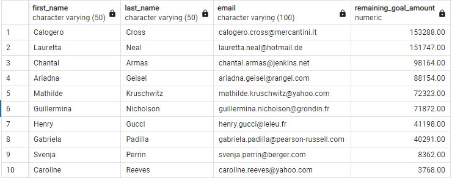

# Crowdfunding ETL - Module 8 Challenge
UNC Chapel Hill Data Analytics Bootcamp

## Overview of Project
For Module 8, Python and PostgreSQL were used to extract, transform, clean, load, and analyze data. Independent Funding, a crowdfunding platform for financing independent projects, provided a multi-worksheet excel file containing information on their campaigns and contact information along with a CSV file with data on their campaign backers. Using Python in conjunction with Jupyter Notebook, the data was extracted, cleaned, and used to create dataframes before being exported as CSV files. These files were then loaded into PostgreSQL for further analysis of the tables.

## Method
### Extract Data
* The data within the original backer_info.csv file was extracted twice to demonstrate proficiency with both Python dictionary methods and regular expressions.
  * Dictionary Methods
    * Through the use of a `for` loop, each row in the [backer_df] dataframe was read into a list, leaving out `backer_id`, `cf_id`, `name`, and `email` but keeping their respective values. This list was then transformed into a dataframe with the previously removed values added as the column names.
    * 
  * Regular Expressions
    * The original `backer_info`'s data was extracted and added to new columns using regular expressions, one column at a time.
    * 

### Transform and Clean Data
* To ensure all columns are correctly typed, the column datatypes were displayed. Because `cf_id` was cast as an object (string) but should be an integer, it was changed to the `int64` datatype.
*  
* The `name` column was split into `first_name` and `last_name` columns, based on the first space found in each name. The original `name` column was then dropped, and the `first_name` and `last_name` columns were moved before the `email` column.
*  

### Create an ERD and Table Schema, and Load Data
* The ERD and table schema were created using quickdatabasediagrams.com, setting up five tables (`backers`, `campaign`, `category`, `contacts`, and `subcategory`), each variable and their respective types, and detailing primary and foreign keys.
* 
* The schema was then used in PostgreSQL to create the tables, variables, and relationships, and the data from the CSV files included in the resources folder were loaded into their respective tables.

### SQL Analysis
* Steps 1 and 2 of SQL analysis showed two ways to calculate the number of backers per crowdfunding campaign and order the campaigns from most to fewest backers.
  * Step 1 used the `campaign` table's `backers_count` to display the number of backers.
  * 
  * Step 2 used the `backers` table and counted the number of times each `cf_id` appeared in the table to calculate the number of backers for each campaign.
  * 
* Step 3 created a new table, `email_contacts_remaining_goal_amount`, to show the names, emails, and remaining goal amount for each live campaign's contact. This table's purpose was to easily access the information needed to email each contact the amount remaining until their campaign hits their goal.
* 
* Step 4 created a new table, `email_backers_remaining_goal_amount`, to show the names, emails, campaign IDs and end dates, company names and descriptions, and the amount left of the goal for each backer. This table, similar to step 3, was made to easily access information to email each backer about the information for each live campaign they've pledged.
* 
Note: Although it is bad practice to include spaces in column names, steps 3 and 4 created columns with spaces to prove proficiency in handling non-ideal column names
